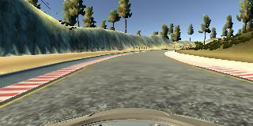
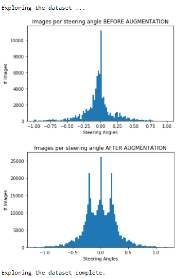
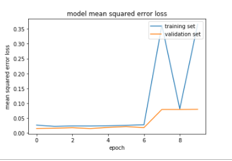
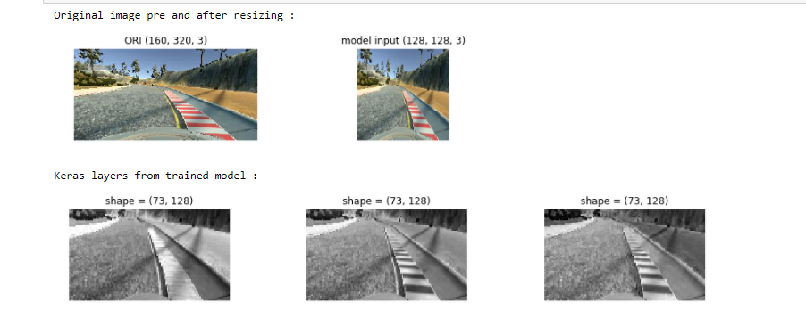
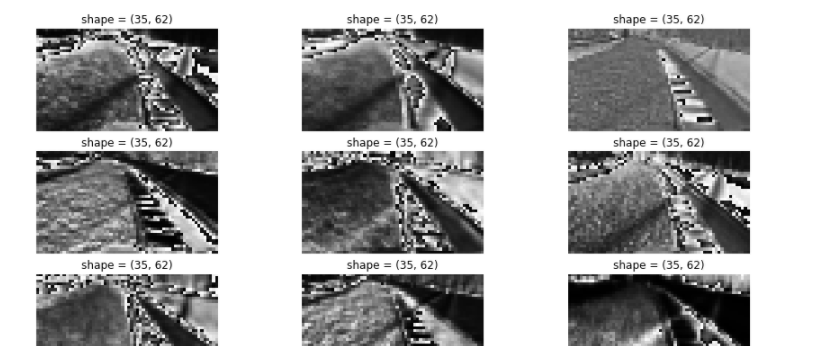
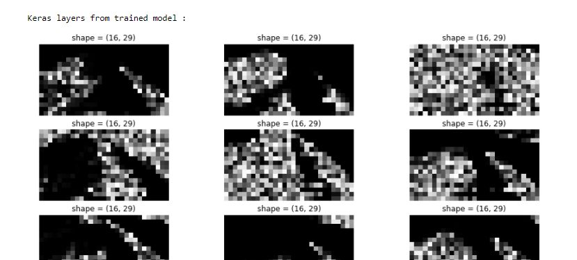
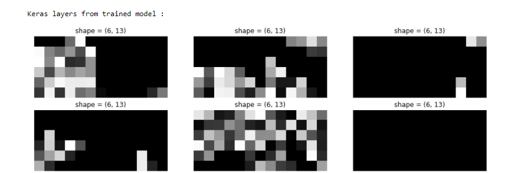
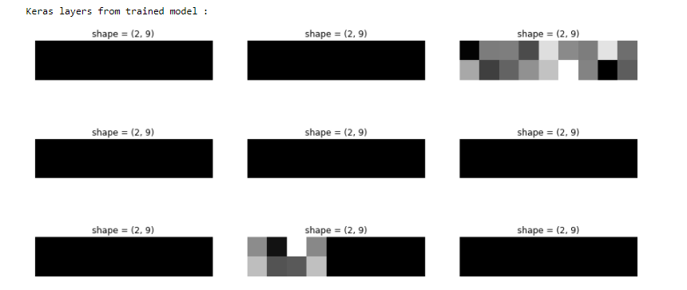

**Behavioral Cloning**
======================

Writeup Template
----------------

###  

**Behavioral Cloning Project**

The goals / steps of this project are the following:

-   Use the simulator to collect data of good driving behavior

-   Design, train and validate a model that predicts a steering angle from image
    data

-   Use the model to drive the vehicle autonomously around the first track in
    the simulator. The vehicle should remain on the road for an entire loop
    around the track.

    

-   Summarize the results with a written report

 

Rubric Points
-------------

#### 1. Required files submission:

My project includes the following files:

-   model.py containing the script to create and train the model

-   drive.py for driving the car in autonomous mode

-   model.h5 containing a trained convolution neural network

-   writeup_report.md or writeup_report.pdf summarizing the results

 

#### 2. Submission includes functional code

Using the Udacity provided simulator and my drive.py file, the car can be driven
autonomously around the track by executing

~~~~~~~~~~~~~~~~~~~~~~~~~~~~~~~~~~~~~~~~~~~~~~~~~~~~~~~~~~~~~~~~~~~~~~~~~~~~~ sh
python drive.py model.h5
~~~~~~~~~~~~~~~~~~~~~~~~~~~~~~~~~~~~~~~~~~~~~~~~~~~~~~~~~~~~~~~~~~~~~~~~~~~~~~~~

 

#### 3. Submission code is usable and readable

The model.py file contains the code for training and saving the convolution
neural network. The file shows the pipeline I used for training and validating
the model, and it contains comments to explain how the code works.

 

### Model Architecture and Training Strategy

#### 1. An appropriate model architecture has been employed

My model consists of a convolution neural network **“Nvidia like”** with 3x3 and
5x5 filter sizes

The model includes ELU layers to introduce nonlinearity, and the data is
normalized in the model using a Keras lambda layer (lambda x: x/127.5 - 1 ).

~~~~~~~~~~~~~~~~~~~~~~~~~~~~~~~~~~~~~~~~~~~~~~~~~~~~~~~~~~~~~~~~~~~~~~~~~~~~~~~~
_________________________________________________________________
Layer (type)                 Output Shape              Param #   
=================================================================
cropping (Cropping2D)        (None, 73, 128, 3)        0         
_________________________________________________________________
lambda_1 (Lambda)            (None, 73, 128, 3)        0         
_________________________________________________________________
Conv1 (Conv2D)               (None, 35, 62, 24)        1824      
_________________________________________________________________
Conv2 (Conv2D)               (None, 16, 29, 36)        21636     
_________________________________________________________________
Conv3 (Conv2D)               (None, 6, 13, 48)         43248     
_________________________________________________________________
Conv4 (Conv2D)               (None, 4, 11, 64)         27712     
_________________________________________________________________
Conv5 (Conv2D)               (None, 2, 9, 64)          36928     
_________________________________________________________________
dropout_1 (Dropout)          (None, 2, 9, 64)          0         
_________________________________________________________________
flatten_1 (Flatten)          (None, 1152)              0         
_________________________________________________________________
dense_1 (Dense)              (None, 100)               115300    
_________________________________________________________________
dropout_2 (Dropout)          (None, 100)               0         
_________________________________________________________________
dense_2 (Dense)              (None, 50)                5050      
_________________________________________________________________
dense_3 (Dense)              (None, 10)                510       
_________________________________________________________________
dense_4 (Dense)              (None, 1)                 11        
=================================================================
Total params: 252,219
Trainable params: 252,219
Non-trainable params: 0
~~~~~~~~~~~~~~~~~~~~~~~~~~~~~~~~~~~~~~~~~~~~~~~~~~~~~~~~~~~~~~~~~~~~~~~~~~~~~~~~

 

#### 2. Attempts to reduce overfitting in the model

The model contains dropout layers in order to reduce overfitting (after the
Convolutional Network , after the Flatten layer).

The model was trained and validated on different data sets to ensure that the
model was not overfitting. The model was tested by running it through the
simulator and ensuring that the vehicle could stay on the track.

#### 3. Model parameter tuning

The model used an adam optimizer, so the learning rate was not tuned manually .

 

#### 4. Appropriate training data

Training data was chosen to keep the vehicle driving on the road. I used a
combination of center lane driving, recovering from the left and right sides of
the road. And I have also used the Track2 to sample data.
Very important was to train the vehicle to recover from the side to the center.

 

### Model Architecture and Training Strategy

 

#### 1. Solution Design Approach

The overall strategy for deriving a model architecture was to reuse an existing
Convolutional Neural Network, and to fine tune it.

 

I have expecially concentrated on the Data Preparation.

Lets riassume the **data preparation** steps:

-   Image list extraction from csv’s

-   Adding recurrent  data ( see below )

-   Splitting the sample list into Training 80%  and Validation 20%

-   Resizing the images down to **128x128**

-   Image cropping to eliminate the front of the car and the upper part of the
    image ( cloud, trees... )

-   Putting the **Center image** with the steering angle, the **left **image
    with steering corrected by a + factor ( see in the code ), the **right
    **image corrected by a -factor ( see in the code ) in a **Pytable for Big
    Data compatibility**

-   Augmenting Center /Left/ Right image by flipping horizontally and reverting
    the sign of the steering .

 

**I have introduced also a new concept. I have introduced “Recurrent Neural
Network”,** done lets say by hand preparing multiple previous images on the
actual steering wheel value:

 

~~~~~~~~~~~~~~~~~~~~~~~~~~~~~~~~~~~~~~~~~~~~~~~~~~~~~~~~~~~~~~~~~~~~~~~~~~~~~~~~
samples_list_recurrent = []
~~~~~~~~~~~~~~~~~~~~~~~~~~~~~~~~~~~~~~~~~~~~~~~~~~~~~~~~~~~~~~~~~~~~~~~~~~~~~~~~

~~~~~~~~~~~~~~~~~~~~~~~~~~~~~~~~~~~~~~~~~~~~~~~~~~~~~~~~~~~~~~~~~~~~~~~~~~~~~~~~
for i,line in enumerate(samples_list):
~~~~~~~~~~~~~~~~~~~~~~~~~~~~~~~~~~~~~~~~~~~~~~~~~~~~~~~~~~~~~~~~~~~~~~~~~~~~~~~~

~~~~~~~~~~~~~~~~~~~~~~~~~~~~~~~~~~~~~~~~~~~~~~~~~~~~~~~~~~~~~~~~~~~~~~~~~~~~~~~~
  if i% 1000 == 0 and i> 0 : print(".. recurrent data processed {}".format(i))     
~~~~~~~~~~~~~~~~~~~~~~~~~~~~~~~~~~~~~~~~~~~~~~~~~~~~~~~~~~~~~~~~~~~~~~~~~~~~~~~~

~~~~~~~~~~~~~~~~~~~~~~~~~~~~~~~~~~~~~~~~~~~~~~~~~~~~~~~~~~~~~~~~~~~~~~~~~~~~~~~~
  for ix in range( max(i-1,0), max(i-5,0), -1):  
~~~~~~~~~~~~~~~~~~~~~~~~~~~~~~~~~~~~~~~~~~~~~~~~~~~~~~~~~~~~~~~~~~~~~~~~~~~~~~~~

~~~~~~~~~~~~~~~~~~~~~~~~~~~~~~~~~~~~~~~~~~~~~~~~~~~~~~~~~~~~~~~~~~~~~~~~~~~~~~~~
      current_steering_angle = line[3]        
~~~~~~~~~~~~~~~~~~~~~~~~~~~~~~~~~~~~~~~~~~~~~~~~~~~~~~~~~~~~~~~~~~~~~~~~~~~~~~~~

~~~~~~~~~~~~~~~~~~~~~~~~~~~~~~~~~~~~~~~~~~~~~~~~~~~~~~~~~~~~~~~~~~~~~~~~~~~~~~~~
      samples_list_recurrent.append([samples_list[ix][0] ,samples_list[ix][1] ,samples_list[ix][2] ,line[3]])
~~~~~~~~~~~~~~~~~~~~~~~~~~~~~~~~~~~~~~~~~~~~~~~~~~~~~~~~~~~~~~~~~~~~~~~~~~~~~~~~

 

The training is done by a batch of 32 and epochs cycle are 10.

 

This is the training result with training loss and validation loss:

~~~~~~~~~~~~~~~~~~~~~~~~~~~~~~~~~~~~~~~~~~~~~~~~~~~~~~~~~~~~~~~~~~~~~~~~~~~~~~~~
Epoch 1/100
9941/9940 [==============================] - 183s - loss: 0.0179 - val_loss: 0.0114
Epoch 2/100
9941/9940 [==============================] - 179s - loss: 0.0115 - val_loss: 0.0098
Epoch 3/100
9941/9940 [==============================] - 180s - loss: 0.0108 - val_loss: 0.0093
Epoch 4/100
9941/9940 [==============================] - 179s - loss: 0.0445 - val_loss: 0.0315
Epoch 5/100
9941/9940 [==============================] - 178s - loss: 0.1237 - val_loss: 0.0685
Epoch 6/100
9941/9940 [==============================] - 177s - loss: 0.1808 - val_loss: 0.0705
Epoch 7/100
9941/9940 [==============================] - 177s - loss: 1.5884 - val_loss: 0.0752
Epoch 8/100
9941/9940 [==============================] - 177s - loss: 0.1018 - val_loss: 0.0664
~~~~~~~~~~~~~~~~~~~~~~~~~~~~~~~~~~~~~~~~~~~~~~~~~~~~~~~~~~~~~~~~~~~~~~~~~~~~~~~~

 

 

**At the end of the process, the vehicle is able to drive autonomously around
the track without leaving the road.**

 

#### 2. Creation of the Training Set

To capture good driving behavior, I first recorded few laps into different
batches  ( data folder / run1, run2, run3 ... )

Here is an example image of center lane driving:

 

I then recorded the vehicle recovering from the left side and right sides of the
road back to center so that the vehicle would learn to return to the center of
the lane:

 

 

Then I repeated this process on track two in order to get more data points.

To augment the data sat, I also flipped images and angles thinking that this
would ... For example, here is an image that has then been flipped:

 

#### 3. Dataset exploration

 

I have a lot of train samples, ( please refer to Big Data consideration below )

 

~~~~~~~~~~~~~~~~~~~~~~~~~~~~~~~~~~~~~~~~~~~~~~~~~~~~~~~~~~~~~~~~~~~~~~~~~~~~~~~~
Total training samples 128x128 after augmentation and preprocessing : 381744

Total validation samples 128x128 after augmentation and preprocessing : 95442
... completed
~~~~~~~~~~~~~~~~~~~~~~~~~~~~~~~~~~~~~~~~~~~~~~~~~~~~~~~~~~~~~~~~~~~~~~~~~~~~~~~~

#### 4. Training

Here you can see the training statistics:

~~~~~~~~~~~~~~~~~~~~~~~~~~~~~~~~~~~~~~~~~~~~~~~~~~~~~~~~~~~~~~~~~~~~~~~~~~~~~~~~
Epoch 1/10
11930/11929 [==============================] - 165s - loss: 0.0262 - val_loss: 0.0150
Epoch 2/10
11930/11929 [==============================] - 148s - loss: 0.0220 - val_loss: 0.0158
Epoch 3/10
11930/11929 [==============================] - 151s - loss: 0.0233 - val_loss: 0.0176
Epoch 4/10
11930/11929 [==============================] - 145s - loss: 0.0232 - val_loss: 0.0147
Epoch 5/10
11930/11929 [==============================] - 145s - loss: 0.0241 - val_loss: 0.0186
Epoch 6/10
11930/11929 [==============================] - 145s - loss: 0.0254 - val_loss: 0.0211
Epoch 7/10
11930/11929 [==============================] - 145s - loss: 0.0275 - val_loss: 0.0178
Epoch 8/10
11930/11929 [==============================] - 144s - loss: 0.3627 - val_loss: 0.0790
Epoch 9/10
11930/11929 [==============================] - 144s - loss: 0.0808 - val_loss: 0.0789
Epoch 10/10
11930/11929 [==============================] - 144s - loss: 0.3662 - val_loss: 0.0794

Total number of train samples: 381744 ( shape 128x128)

Batch Size                   : 32

Duration                     : 0:24:41.647470

 .. model saved to model.h5

~~~~~~~~~~~~~~~~~~~~~~~~~~~~~~~~~~~~~~~~~~~~~~~~~~~~~~~~~~~~~~~~~~~~~~~~~~~~~~~~

 

**The image below shows, that we need less than 10 epochs:**

 

 

 

 

### **Trained model exploration**

 

1.  Loading the model from disk:

    ~~~~~~~~~~~~~~~~~~~~~~~~~~~~~~~~~~~~~~~~~~~~~~~~~~~~~~~~~~~~~~~~~~~~~~~~~~~~
    print (" Loading drive.h5 .......")
    ~~~~~~~~~~~~~~~~~~~~~~~~~~~~~~~~~~~~~~~~~~~~~~~~~~~~~~~~~~~~~~~~~~~~~~~~~~~~

    ~~~~~~~~~~~~~~~~~~~~~~~~~~~~~~~~~~~~~~~~~~~~~~~~~~~~~~~~~~~~~~~~~~~~~~~~~~~~

    ~~~~~~~~~~~~~~~~~~~~~~~~~~~~~~~~~~~~~~~~~~~~~~~~~~~~~~~~~~~~~~~~~~~~~~~~~~~~

    ~~~~~~~~~~~~~~~~~~~~~~~~~~~~~~~~~~~~~~~~~~~~~~~~~~~~~~~~~~~~~~~~~~~~~~~~~~~~
    from keras.models import load_model
    ~~~~~~~~~~~~~~~~~~~~~~~~~~~~~~~~~~~~~~~~~~~~~~~~~~~~~~~~~~~~~~~~~~~~~~~~~~~~

    ~~~~~~~~~~~~~~~~~~~~~~~~~~~~~~~~~~~~~~~~~~~~~~~~~~~~~~~~~~~~~~~~~~~~~~~~~~~~
    from keras.models import Model
    ~~~~~~~~~~~~~~~~~~~~~~~~~~~~~~~~~~~~~~~~~~~~~~~~~~~~~~~~~~~~~~~~~~~~~~~~~~~~

    ~~~~~~~~~~~~~~~~~~~~~~~~~~~~~~~~~~~~~~~~~~~~~~~~~~~~~~~~~~~~~~~~~~~~~~~~~~~~

    ~~~~~~~~~~~~~~~~~~~~~~~~~~~~~~~~~~~~~~~~~~~~~~~~~~~~~~~~~~~~~~~~~~~~~~~~~~~~

    ~~~~~~~~~~~~~~~~~~~~~~~~~~~~~~~~~~~~~~~~~~~~~~~~~~~~~~~~~~~~~~~~~~~~~~~~~~~~
    modelobj = load_model('model.h5')
    ~~~~~~~~~~~~~~~~~~~~~~~~~~~~~~~~~~~~~~~~~~~~~~~~~~~~~~~~~~~~~~~~~~~~~~~~~~~~

    ~~~~~~~~~~~~~~~~~~~~~~~~~~~~~~~~~~~~~~~~~~~~~~~~~~~~~~~~~~~~~~~~~~~~~~~~~~~~
    print (" ..... model model.h5 successfully loaded")
    ~~~~~~~~~~~~~~~~~~~~~~~~~~~~~~~~~~~~~~~~~~~~~~~~~~~~~~~~~~~~~~~~~~~~~~~~~~~~

 

1.  Loading test image:

    ~~~~~~~~~~~~~~~~~~~~~~~~~~~~~~~~~~~~~~~~~~~~~~~~~~~~~~~~~~~~~~~~~~~~~~~~~~~~
    image = cv2.imread('./test_images/center1.jpg')
    ~~~~~~~~~~~~~~~~~~~~~~~~~~~~~~~~~~~~~~~~~~~~~~~~~~~~~~~~~~~~~~~~~~~~~~~~~~~~

 

1.  Check if the images are cropped correctly:

1.  **First Layer ** - Conv Layer 5x5 , 24 filters  ( To see all the images go
    please to **model.ipynb **)

1.  **Second layer** - Conv Layer 5x5 , 36 filters ( To see all the images go
    please to **model.ipynb **)

1.  **Third Layer **- Conv Layer 5x5 , 48 filters ( To see all the images go
    please to **model.ipynb **)

1.  **4th **Conv Layer 3x3 , 64 filters ( To see all the images go please to
    **model.ipynb **)

1.  **5th** Conv Layer 3x3 , 64 filters ( To see all the images go please to
    **model.ipynb **)

 

### **​Consideration about Big Data on  GPU machine ( Nvidia GTX 1060 )**

The proposed in Udacity solution was too slow for training a lot of data.

The problem was that the generator was reading every time, every image from
disk, and preprocessing it again and again.

 

A second solution would be to keep the preprocessed images (64x64 pixels ) in
memory, but this solution is not scalable in a Big Data future implementation.
Also in my solution were I have used around 200.000 images , it was also near
the memory RAM limit.

 

So I have decided to try this solution :

#### 1. Introduce the **Pytable**

Table definition

~~~~~~~~~~~~~~~~~~~~~~~~~~~~~~~~~~~~~~~~~~~~~~~~~~~~~~~~~~~~~~~~~~~~~~~~~~~~~~~~
hdf5_training = open_file(ssd_folder + "/training_samples.hdf5", mode = "w", title = "Training Samples")

py_training_samples   = hdf5_training.create_earray(hdf5_training.root, \
                    'training_images', \
                    tables.UInt8Atom(), \
                    shape=( 0,resized_shape, resized_shape, 3),chunkshape=(batch_size*queue_loader_chunk ,resized_shape,resized_shape,3))
~~~~~~~~~~~~~~~~~~~~~~~~~~~~~~~~~~~~~~~~~~~~~~~~~~~~~~~~~~~~~~~~~~~~~~~~~~~~~~~~

 

The *preprocess is reading from disk *and writing directly a Pytable on a SSD
disk:

 

~~~~~~~~~~~~~~~~~~~~~~~~~~~~~~~~~~~~~~~~~~~~~~~~~~~~~~~~~~~~~~~~~~~~~~~~~~~~~~~~
  for output in data_preprocess(sample_line):
~~~~~~~~~~~~~~~~~~~~~~~~~~~~~~~~~~~~~~~~~~~~~~~~~~~~~~~~~~~~~~~~~~~~~~~~~~~~~~~~

~~~~~~~~~~~~~~~~~~~~~~~~~~~~~~~~~~~~~~~~~~~~~~~~~~~~~~~~~~~~~~~~~~~~~~~~~~~~~~~~
        py_training_samples.append(output[0][None])
~~~~~~~~~~~~~~~~~~~~~~~~~~~~~~~~~~~~~~~~~~~~~~~~~~~~~~~~~~~~~~~~~~~~~~~~~~~~~~~~

~~~~~~~~~~~~~~~~~~~~~~~~~~~~~~~~~~~~~~~~~~~~~~~~~~~~~~~~~~~~~~~~~~~~~~~~~~~~~~~~
        training_steering.append(output[1])
~~~~~~~~~~~~~~~~~~~~~~~~~~~~~~~~~~~~~~~~~~~~~~~~~~~~~~~~~~~~~~~~~~~~~~~~~~~~~~~~

The **[None] **is used to introduce a further dimension , thats the number of
images stored.

Here you can see the Structure of **py_training_samples   **:

~~~~~~~~~~~~~~~~~~~~~~~~~~~~~~~~~~~~~~~~~~~~~~~~~~~~~~~~~~~~~~~~~~~~~~~~~~~~~~~~
/training_images (EArray(381744, 128, 128, 3)) ''
~~~~~~~~~~~~~~~~~~~~~~~~~~~~~~~~~~~~~~~~~~~~~~~~~~~~~~~~~~~~~~~~~~~~~~~~~~~~~~~~

~~~~~~~~~~~~~~~~~~~~~~~~~~~~~~~~~~~~~~~~~~~~~~~~~~~~~~~~~~~~~~~~~~~~~~~~~~~~~~~~
  atom := UInt8Atom(shape=(), dflt=0)
~~~~~~~~~~~~~~~~~~~~~~~~~~~~~~~~~~~~~~~~~~~~~~~~~~~~~~~~~~~~~~~~~~~~~~~~~~~~~~~~

~~~~~~~~~~~~~~~~~~~~~~~~~~~~~~~~~~~~~~~~~~~~~~~~~~~~~~~~~~~~~~~~~~~~~~~~~~~~~~~~
  maindim := 0
~~~~~~~~~~~~~~~~~~~~~~~~~~~~~~~~~~~~~~~~~~~~~~~~~~~~~~~~~~~~~~~~~~~~~~~~~~~~~~~~

~~~~~~~~~~~~~~~~~~~~~~~~~~~~~~~~~~~~~~~~~~~~~~~~~~~~~~~~~~~~~~~~~~~~~~~~~~~~~~~~
  flavor := 'numpy'
~~~~~~~~~~~~~~~~~~~~~~~~~~~~~~~~~~~~~~~~~~~~~~~~~~~~~~~~~~~~~~~~~~~~~~~~~~~~~~~~

~~~~~~~~~~~~~~~~~~~~~~~~~~~~~~~~~~~~~~~~~~~~~~~~~~~~~~~~~~~~~~~~~~~~~~~~~~~~~~~~
  byteorder := 'irrelevant'
~~~~~~~~~~~~~~~~~~~~~~~~~~~~~~~~~~~~~~~~~~~~~~~~~~~~~~~~~~~~~~~~~~~~~~~~~~~~~~~~

~~~~~~~~~~~~~~~~~~~~~~~~~~~~~~~~~~~~~~~~~~~~~~~~~~~~~~~~~~~~~~~~~~~~~~~~~~~~~~~~
  chunkshape := (64000, 128, 128, 3)
~~~~~~~~~~~~~~~~~~~~~~~~~~~~~~~~~~~~~~~~~~~~~~~~~~~~~~~~~~~~~~~~~~~~~~~~~~~~~~~~

 

#### 2. Introduce the **Asynchronous processing**

So i have thought to build two separate process:

1 - A process that reads from disk and insert Big Chunks of data , lets day
64000 images per time, into a Memory buffer ( a python Queue ). I use
**multiprocessing.Process** class.

The great thing about Python Queue is that , if we define the **maxsize
(batch_size \* queue_loader_chunk)**, the put instruction in case the Queue is
full, will wait until will be some space free.

 

2- the second process , that’s the training itself with Keras

 

This split allows to maximize the different CPU cores, while Keras can do it
with the** workers=n.**

Further, using a memory buffer it allows to optimize the data flush from SSD to
GPU, that need to pass from the memory.

 

As I can see from my tests, I have improved the GPU utilization from 40% to 80%
.

 

#### 3. Threading the Buffering from SSD to memory

NOTE: this solution is not implemented in the code because of a unresolved bug,
see below.

Here I have tried to go further and build a multiple thread process that loads
data into the Memory.

There is still a problem , and thats about data shuffle. If you are interested
you can have a look into

**model_partitioned.ipynb** .

 

Here I tried to go further If you are interested in other details, you can read
my Stories on Medium:

 

[Deep Learning . Training with huge amount of data
.PART1](https://medium.com/@cristianzantedeschi/deep-learning-regression-feeding-huge-amount-of-data-to-gpu-performance-considerations-2934d32ab315)

[Deep Learning . Training with Huge amount of data .
PART2](https://medium.com/@cristianzantedeschi/github-link-https-github-com-cristianku-carnd-behavioral-cloning-project3-blob-master-model-5d27ff7394b6)

[Deep Learning . Training with Huge amount of data .
PART3](https://medium.com/@cristianzantedeschi/deep-learning-training-with-huge-amount-of-data-part3-e4bf83ff8cc6)

 

#### 4. What about shuffling the data ?

Its important to note, that in the solutions before ( Udacity, shuffling the
entire sample list , not the image array), or the big image array in memory, the
shuffling was done in the **generator** at the** begin of each epoch**

Because now I am reading data in chunk from disk, the generetor doesnt have all
the data in hands, but only eventually this big chunk, or , in other words, the
Python Queue.

 

Because shuffling a Queue is a loss of performance ( very slow ), I had to
transfer shuffling data into the Queue loader:

1.  Queue loader reads a Big Chunk from Pytable ( from disk ):

    ~~~~~~~~~~~~~~~~~~~~~~~~~~~~~~~~~~~~~~~~~~~~~~~~~~~~~~~~~~~~~~~~~~~~~~~~~~~~
    chunk_batch_samples = samples[offset:offset+step]
    ~~~~~~~~~~~~~~~~~~~~~~~~~~~~~~~~~~~~~~~~~~~~~~~~~~~~~~~~~~~~~~~~~~~~~~~~~~~~

    ~~~~~~~~~~~~~~~~~~~~~~~~~~~~~~~~~~~~~~~~~~~~~~~~~~~~~~~~~~~~~~~~~~~~~~~~~~~~
    chunk_batch_labels  = labels[offset:offset+step]
    ~~~~~~~~~~~~~~~~~~~~~~~~~~~~~~~~~~~~~~~~~~~~~~~~~~~~~~~~~~~~~~~~~~~~~~~~~~~~

2.  **SHUFFLE using sklearn.utils.shuffle**

    ~~~~~~~~~~~~~~~~~~~~~~~~~~~~~~~~~~~~~~~~~~~~~~~~~~~~~~~~~~~~~~~~~~~~~~~~~~~~
    chunk_batch_samples, chunk_batch_labels = shuffle(chunk_batch_samples, chunk_batch_labels )
    ~~~~~~~~~~~~~~~~~~~~~~~~~~~~~~~~~~~~~~~~~~~~~~~~~~~~~~~~~~~~~~~~~~~~~~~~~~~~

3.  Putting data into the Python Queue (maxsize = batch_size \*
    queue_loader_chunk)

    ~~~~~~~~~~~~~~~~~~~~~~~~~~~~~~~~~~~~~~~~~~~~~~~~~~~~~~~~~~~~~~~~~~~~~~~~~~~~
    for sample, steering in zip ( chunk_batch_samples,chunk_batch_labels):
    ~~~~~~~~~~~~~~~~~~~~~~~~~~~~~~~~~~~~~~~~~~~~~~~~~~~~~~~~~~~~~~~~~~~~~~~~~~~~

    ~~~~~~~~~~~~~~~~~~~~~~~~~~~~~~~~~~~~~~~~~~~~~~~~~~~~~~~~~~~~~~~~~~~~~~~~~~~~
          samples_q.put(sample)
    ~~~~~~~~~~~~~~~~~~~~~~~~~~~~~~~~~~~~~~~~~~~~~~~~~~~~~~~~~~~~~~~~~~~~~~~~~~~~

    ~~~~~~~~~~~~~~~~~~~~~~~~~~~~~~~~~~~~~~~~~~~~~~~~~~~~~~~~~~~~~~~~~~~~~~~~~~~~
          labels_q.put(steering)
    ~~~~~~~~~~~~~~~~~~~~~~~~~~~~~~~~~~~~~~~~~~~~~~~~~~~~~~~~~~~~~~~~~~~~~~~~~~~~

 

The Big Chunk ( the Queue size ) need **to be big enough**

1.  to increase the performance

2.  not too big ( RAM memory limitations )

3.  need to shuffle as many data as possible ( to avoid repeating training on
    same data )

    Obiously the best shuffle is done on the entire dataset, but **in this Big
    Data solution is not possible.**
