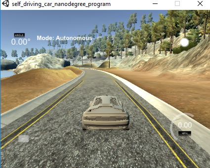
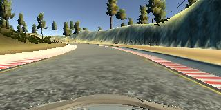
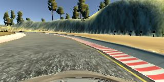
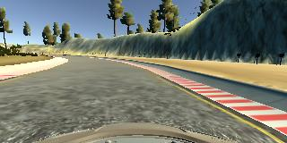
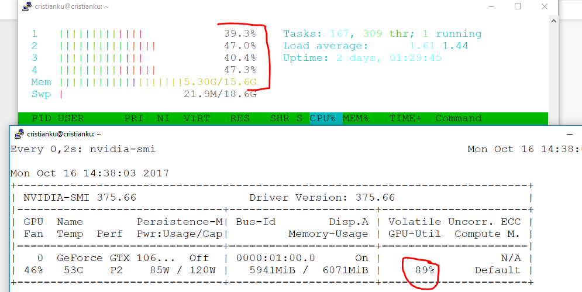

**Behavioral Cloning**
======================

Writeup report

###  

**Behavioral Cloning Project**

The goals / steps of this project are the following:

-   Use the simulator to **collect data** of *good driving behavior*

-   **Design**, **train** and **validate** a model that *predicts a steering
    angle* from image data

-   Use the **model to drive the vehicle autonomously** around the first track
    in the simulator. The vehicle should remain on the road for an entire loop
    around the track.

    

-   Summarize the results with a written report

 

**Important points to pass the project**
========================================

#### 1. Required files submission:

My project includes the following files:

-   **model.ipynb** containing the script to create and train the model

-   **model.pdf** containing the executed script model.ipynb

-   **drive.py** for driving the car in autonomous mode

-   **model.h5** containing a trained convolution neural network

-   **writeup_report.md** summarizing the results

 

#### 2. Testing the model on the road

Using the Udacity provided simulator and my drive.py file, the car can be driven
autonomously around the track by executing

~~~~~~~~~~~~~~~~~~~~~~~~~~~~~~~~~~~~~~~~~~~~~~~~~~~~~~~~~~~~~~~~~~~~~~~~~~~~~ sh
python drive.py model.h5
~~~~~~~~~~~~~~~~~~~~~~~~~~~~~~~~~~~~~~~~~~~~~~~~~~~~~~~~~~~~~~~~~~~~~~~~~~~~~~~~

 

#### 3. Code readability and clearness

The **model.ipynb** file contains the code for training and saving the
convolution neural network.

The file shows the pipeline I used for training and validating the model, and it
contains comments to explain how the code works.

 

**Model Architecture and Training Strategy**
============================================

#### 1. An appropriate model architecture has been employed

My model consists of a convolution neural network **“Nvidia like”** with 3x3 but
without the last 5x5 filters

See in the section **Trained model exploration** below a visual explanation why
I decided to drop the last two layers

The model includes ELU layers to introduce nonlinearity, and the data is
normalized in the model using a Keras lambda layer (lambda x: x/127.5 - 1 ).

~~~~~~~~~~~~~~~~~~~~~~~~~~~~~~~~~~~~~~~~~~~~~~~~~~~~~~~~~~~~~~~~~~~~~~~~~~~~~~~~
_________________________________________________________________
Layer (type)                 Output Shape              Param #   
=================================================================
cropping (Cropping2D)        (None, 73, 128, 3)        0         
_________________________________________________________________
lambda_1 (Lambda)            (None, 73, 128, 3)        0         
_________________________________________________________________
Conv1 (Conv2D)               (None, 35, 62, 24)        1824      
_________________________________________________________________
Conv2 (Conv2D)               (None, 16, 29, 36)        21636     
_________________________________________________________________
Conv3 (Conv2D)               (None, 6, 13, 48)         43248     
_________________________________________________________________
Conv4 (Conv2D)               (None, 4, 11, 64)         27712     
_________________________________________________________________
Conv5 (Conv2D)               (None, 2, 9, 64)          36928     
_________________________________________________________________
dropout_1 (Dropout)          (None, 2, 9, 64)          0         
_________________________________________________________________
flatten_1 (Flatten)          (None, 1152)              0         
_________________________________________________________________
dense_1 (Dense)              (None, 100)               115300    
_________________________________________________________________
dropout_2 (Dropout)          (None, 100)               0         
_________________________________________________________________
dense_2 (Dense)              (None, 50)                5050      
_________________________________________________________________
dense_3 (Dense)              (None, 10)                510       
_________________________________________________________________
dense_4 (Dense)              (None, 1)                 11        
=================================================================
Total params: 252,219
Trainable params: 252,219
Non-trainable params: 0
~~~~~~~~~~~~~~~~~~~~~~~~~~~~~~~~~~~~~~~~~~~~~~~~~~~~~~~~~~~~~~~~~~~~~~~~~~~~~~~~

 

#### 2. Attempts to reduce overfitting in the model

The model contains **dropout layers** in order to reduce overfitting (after the
Convolutional Network , after the Flatten layer).

The model was trained and validated on different data sets to ensure that the
model was not overfitting. The model was tested by running it through the
simulator and ensuring that the vehicle could stay on the track.

 

#### 3. Model parameter tuning

The model used an **adam optimizer**, so the learning rate was not tuned
manually .

 

#### 4. Appropriate training data

Training data was chosen to keep the vehicle driving on the road. I used a
combination of center lane driving, recovering from the left and right sides of
the road. And I have also used the **Track2** to sample data.

Very important was to t**rain the vehicle to recover** from the side to the
center.

I have now a lot of images to train with:

 

~~~~~~~~~~~~~~~~~~~~~~~~~~~~~~~~~~~~~~~~~~~~~~~~~~~~~~~~~~~~~~~~~~~~~~~~~~~~~~~~
Starting .... 
Reading from logfile = /ssd_data/project3/run5.csv
Reading from logfile = /ssd_data/project3/run3.csv
Reading from logfile = /ssd_data/project3/run4.csv
Reading from logfile = /ssd_data/project3/track1_run1.csv
Reading from logfile = /ssd_data/project3/run7.csv
Reading from logfile = /ssd_data/project3/run2.csv
Reading from logfile = /ssd_data/project3/run6.csv
Reading from logfile = /ssd_data/project3/run1.csv

There are 18392 samples in total 
~~~~~~~~~~~~~~~~~~~~~~~~~~~~~~~~~~~~~~~~~~~~~~~~~~~~~~~~~~~~~~~~~~~~~~~~~~~~~~~~

 

**Model Architecture and Training Strategy**
============================================

 

#### 1. Solution Design Approach

The overall strategy for deriving a model architecture was to reuse an existing
Convolutional Neural Network, and to fine tune it.

 

My model consists of a convolution neural network **“Nvidia like”** with 3x3 but
without the last 5x5 filters

See in the section **Trained model exploration** below a visual explanation why
I decided to drop the last two layers

The model includes ELU layers to introduce nonlinearity, and the data is
normalized in the model using a Keras lambda layer (lambda x: x/127.5 - 1 ).

 

#### 2. Attempts to reduce overfitting in the model

-   The model contains **dropout layers** in order to reduce overfitting (after
    the Convolutional Network , after the Flatten layer).

-   The model **was trained and validated on different data sets** to ensure
    that the model was not overfitting.

-   The model **was tested by running it through the simulator** and *ensuring
    that the vehicle could stay on the track*

 

#### 3. Dataset creation

I have recorded using the simulator a **good driving behavior.**

I have recorded different laps into different recordings ( data folder / run1,
run2, run3 ... )

Here is an example image of center lane driving:

I then recorded the vehicle **recovering from the left side and right side**s

of the road back to center so that the vehicle would learn

to return to the center of the lane:

 

 

Then I repeated this process on **track two** in order to get more data points.

 

#### 3. Data preprocessing

I put more concentration on the Data Preparation:

-   Image list extraction from csv’s

-   Adding recurrent data ( see below )

-   Splitting the sample list into Training 80% and Validation 20%

-   Resizing the images down to **128x128**

-   Image cropping to eliminate the front of the car and the upper part of the
    image ( cloud, trees... )

-   Using also the left and right images with a corrected steering angle:

    -   **left** image with steering corrected by a **+** factor ( see in the
        code ),

    -   **right** image corrected by a **-** factor ( see in the code )

    To choose the factor , I have tried many different and it seems that the
    best fit is with 0.1

    I have also tried to understand what is the best correction by recovering
    from the side and look at the steering angle ( the average is\*\* 0.03\*\*
    but it seems to me TOO small, so I have decided for **0.1** ):

    

-   Using **Pytable**s\*\* for Big Data compatibility \*\* ( see the last
    section below )

-   Augmenting Center /Left/ Right image by flipping horizontally and reverting
    the sign of the steering .

 

 

#### 2. Recurrent Neural Network

**I have tried to introduced a recurrent pattern recognition**

In the preparation phase I have added to **the actual steering angle** multiple
previous images :

 

~~~~~~~~~~~~~~~~~~~~~~~~~~~~~~~~~~~~~~~~~~~~~~~~~~~~~~~~~~~~~~~~~~~~~~~~~~~~~~~~
samples_list_recurrent = []
~~~~~~~~~~~~~~~~~~~~~~~~~~~~~~~~~~~~~~~~~~~~~~~~~~~~~~~~~~~~~~~~~~~~~~~~~~~~~~~~

~~~~~~~~~~~~~~~~~~~~~~~~~~~~~~~~~~~~~~~~~~~~~~~~~~~~~~~~~~~~~~~~~~~~~~~~~~~~~~~~
for i,line in enumerate(samples_list):
~~~~~~~~~~~~~~~~~~~~~~~~~~~~~~~~~~~~~~~~~~~~~~~~~~~~~~~~~~~~~~~~~~~~~~~~~~~~~~~~

~~~~~~~~~~~~~~~~~~~~~~~~~~~~~~~~~~~~~~~~~~~~~~~~~~~~~~~~~~~~~~~~~~~~~~~~~~~~~~~~
  if i% 1000 == 0 and i> 0 : print(".. recurrent data processed {}".format(i))     
~~~~~~~~~~~~~~~~~~~~~~~~~~~~~~~~~~~~~~~~~~~~~~~~~~~~~~~~~~~~~~~~~~~~~~~~~~~~~~~~

~~~~~~~~~~~~~~~~~~~~~~~~~~~~~~~~~~~~~~~~~~~~~~~~~~~~~~~~~~~~~~~~~~~~~~~~~~~~~~~~
  for ix in range( max(i-1,0), max(i-5,0), -1):  
~~~~~~~~~~~~~~~~~~~~~~~~~~~~~~~~~~~~~~~~~~~~~~~~~~~~~~~~~~~~~~~~~~~~~~~~~~~~~~~~

~~~~~~~~~~~~~~~~~~~~~~~~~~~~~~~~~~~~~~~~~~~~~~~~~~~~~~~~~~~~~~~~~~~~~~~~~~~~~~~~
      current_steering_angle = line[3]        
~~~~~~~~~~~~~~~~~~~~~~~~~~~~~~~~~~~~~~~~~~~~~~~~~~~~~~~~~~~~~~~~~~~~~~~~~~~~~~~~

~~~~~~~~~~~~~~~~~~~~~~~~~~~~~~~~~~~~~~~~~~~~~~~~~~~~~~~~~~~~~~~~~~~~~~~~~~~~~~~~
      samples_list_recurrent.append([samples_list[ix][0] ,samples_list[ix][1] ,samples_list[ix][2] ,line[3]])
~~~~~~~~~~~~~~~~~~~~~~~~~~~~~~~~~~~~~~~~~~~~~~~~~~~~~~~~~~~~~~~~~~~~~~~~~~~~~~~~

 

#### 3. Dataset exploration

Initially I had the following number of images coming from the **simulator
sampling phase:**

~~~~~~~~~~~~~~~~~~~~~~~~~~~~~~~~~~~~~~~~~~~~~~~~~~~~~~~~~~~~~~~~~~~~~~~~~~~~~~~~
Reading from logfile = /ssd_data/project3/run5.csv
Reading from logfile = /ssd_data/project3/run3.csv
Reading from logfile = /ssd_data/project3/run4.csv
Reading from logfile = /ssd_data/project3/track1_run1.csv
Reading from logfile = /ssd_data/project3/run7.csv
Reading from logfile = /ssd_data/project3/run2.csv
Reading from logfile = /ssd_data/project3/run6.csv
Reading from logfile = /ssd_data/project3/run1.csv

There are 18392 samples in total 
~~~~~~~~~~~~~~~~~~~~~~~~~~~~~~~~~~~~~~~~~~~~~~~~~~~~~~~~~~~~~~~~~~~~~~~~~~~~~~~~

 

And **after preprocessing and augmenting:**

~~~~~~~~~~~~~~~~~~~~~~~~~~~~~~~~~~~~~~~~~~~~~~~~~~~~~~~~~~~~~~~~~~~~~~~~~~~~~~~~
Total training samples 128x128 after augmentation and preprocessing : 381744

Total validation samples 128x128 after augmentation and preprocessing : 95442
... completed
~~~~~~~~~~~~~~~~~~~~~~~~~~~~~~~~~~~~~~~~~~~~~~~~~~~~~~~~~~~~~~~~~~~~~~~~~~~~~~~~

*Visual representation:*

 

#### 4. Training

Here you can see the training statistics:

~~~~~~~~~~~~~~~~~~~~~~~~~~~~~~~~~~~~~~~~~~~~~~~~~~~~~~~~~~~~~~~~~~~~~~~~~~~~~~~~
Epoch 1/10
11930/11929 [==============================] - 165s - loss: 0.0262 - val_loss: 0.0150
Epoch 2/10
11930/11929 [==============================] - 148s - loss: 0.0220 - val_loss: 0.0158
Epoch 3/10
11930/11929 [==============================] - 151s - loss: 0.0233 - val_loss: 0.0176
Epoch 4/10
11930/11929 [==============================] - 145s - loss: 0.0232 - val_loss: 0.0147
Epoch 5/10
11930/11929 [==============================] - 145s - loss: 0.0241 - val_loss: 0.0186
Epoch 6/10
11930/11929 [==============================] - 145s - loss: 0.0254 - val_loss: 0.0211
Epoch 7/10
11930/11929 [==============================] - 145s - loss: 0.0275 - val_loss: 0.0178
Epoch 8/10
11930/11929 [==============================] - 144s - loss: 0.3627 - val_loss: 0.0790
Epoch 9/10
11930/11929 [==============================] - 144s - loss: 0.0808 - val_loss: 0.0789
Epoch 10/10
11930/11929 [==============================] - 144s - loss: 0.3662 - val_loss: 0.0794

Total number of train samples: 381744 ( shape 128x128)

Batch Size                   : 32

Duration                     : 0:24:41.647470

 .. model saved to model.h5
~~~~~~~~~~~~~~~~~~~~~~~~~~~~~~~~~~~~~~~~~~~~~~~~~~~~~~~~~~~~~~~~~~~~~~~~~~~~~~~~

 

**The image below shows, that we need less than 10 epochs:**

 

#### .

 

**Trained model exploration**
=============================

 

-   Loading the model from disk:

    ~~~~~~~~~~~~~~~~~~~~~~~~~~~~~~~~~~~~~~~~~~~~~~~~~~~~~~~~~~~~~~~~~~~~~~~~~~~~
    print (" Loading drive.h5 .......")
    ~~~~~~~~~~~~~~~~~~~~~~~~~~~~~~~~~~~~~~~~~~~~~~~~~~~~~~~~~~~~~~~~~~~~~~~~~~~~

    ~~~~~~~~~~~~~~~~~~~~~~~~~~~~~~~~~~~~~~~~~~~~~~~~~~~~~~~~~~~~~~~~~~~~~~~~~~~~

    ~~~~~~~~~~~~~~~~~~~~~~~~~~~~~~~~~~~~~~~~~~~~~~~~~~~~~~~~~~~~~~~~~~~~~~~~~~~~

    ~~~~~~~~~~~~~~~~~~~~~~~~~~~~~~~~~~~~~~~~~~~~~~~~~~~~~~~~~~~~~~~~~~~~~~~~~~~~
    from keras.models import load_model
    ~~~~~~~~~~~~~~~~~~~~~~~~~~~~~~~~~~~~~~~~~~~~~~~~~~~~~~~~~~~~~~~~~~~~~~~~~~~~

    ~~~~~~~~~~~~~~~~~~~~~~~~~~~~~~~~~~~~~~~~~~~~~~~~~~~~~~~~~~~~~~~~~~~~~~~~~~~~
    from keras.models import Model
    ~~~~~~~~~~~~~~~~~~~~~~~~~~~~~~~~~~~~~~~~~~~~~~~~~~~~~~~~~~~~~~~~~~~~~~~~~~~~

    ~~~~~~~~~~~~~~~~~~~~~~~~~~~~~~~~~~~~~~~~~~~~~~~~~~~~~~~~~~~~~~~~~~~~~~~~~~~~

    ~~~~~~~~~~~~~~~~~~~~~~~~~~~~~~~~~~~~~~~~~~~~~~~~~~~~~~~~~~~~~~~~~~~~~~~~~~~~

    ~~~~~~~~~~~~~~~~~~~~~~~~~~~~~~~~~~~~~~~~~~~~~~~~~~~~~~~~~~~~~~~~~~~~~~~~~~~~
    modelobj = load_model('model.h5')
    ~~~~~~~~~~~~~~~~~~~~~~~~~~~~~~~~~~~~~~~~~~~~~~~~~~~~~~~~~~~~~~~~~~~~~~~~~~~~

    ~~~~~~~~~~~~~~~~~~~~~~~~~~~~~~~~~~~~~~~~~~~~~~~~~~~~~~~~~~~~~~~~~~~~~~~~~~~~
    print (" ..... model model.h5 successfully loaded")
    ~~~~~~~~~~~~~~~~~~~~~~~~~~~~~~~~~~~~~~~~~~~~~~~~~~~~~~~~~~~~~~~~~~~~~~~~~~~~

 

-   Loading test image:

    ~~~~~~~~~~~~~~~~~~~~~~~~~~~~~~~~~~~~~~~~~~~~~~~~~~~~~~~~~~~~~~~~~~~~~~~~~~~~
    image = cv2.imread('./test_images/center1.jpg')
    ~~~~~~~~~~~~~~~~~~~~~~~~~~~~~~~~~~~~~~~~~~~~~~~~~~~~~~~~~~~~~~~~~~~~~~~~~~~~

 

-   Check if the images are cropped correctly:

**1 - First Layer** - Conv Layer 5x5 , 24 filters ( To see all the images go
please to **model.ipynb** )

**2 - Second layer** - Conv Layer 5x5 , 36 filters ( To see all the images go
please to **model.ipynb** )

**3 - Third Layer** - Conv Layer 5x5 , 48 filters ( To see all the images go
please to **model.ipynb** )

 

**\*\* —— THERE LAYERS HAS BEEN DROPPED BECAUSE THEY ARE LOOSING INFORMATIONS
-------------\*\***

**4 - 4th** Conv Layer 3x3 , 64 filters ( To see all the images go please to
**model.ipynb** )

1.  **5th** Conv Layer 3x3 , 64 filters ( To see all the images go please to
    **model.ipynb** )

 

**Testing the model with the simulator:**
=========================================

 

The following command will load the trained model and use the model to make
predictions on individual images in real-time and send the predicted angle back
to the server via a websocket connection.

I will also take a series a picture in **run1** that will be used later to
create a video

~~~~~~~~~~~~~~~~~~~~~~~~~~~~~~~~~~~~~~~~~~~~~~~~~~~~~~~~~~~~~~~~~~~~~~~~~~~~~~~~
   python drive.py model.h5 run1
~~~~~~~~~~~~~~~~~~~~~~~~~~~~~~~~~~~~~~~~~~~~~~~~~~~~~~~~~~~~~~~~~~~~~~~~~~~~~~~~

**​​**
====

Creating a videoclip:

~~~~~~~~~~~~~~~~~~~~~~~~~~~~~~~~~~~~~~~~~~~~~~~~~~~~~~~~~~~~~~~~~~~~~~~~~~~~~~~~
python video.py run1
~~~~~~~~~~~~~~~~~~~~~~~~~~~~~~~~~~~~~~~~~~~~~~~~~~~~~~~~~~~~~~~~~~~~~~~~~~~~~~~~

 

 

**Consideration about Big Data on GPU machine ( Nvidia GTX 1060 )**
===================================================================

The proposed in Udacity solution was too slow for training a lot of data.

The problem was that the generator was reading every time, every single image
from the disk, and preprocessing it again and again every time. Choosing an SSD
instead of HDD didnt helped much

 

A second solution would be to keep the preprocessed **ALL the images (64x64
pixels ) in memory,** but this solution is not scalable in a Big Data future
implementation ( because of limited RAM resources).

 

**So here instead my solution:**

#### 1. Store the preprocessed images into **Pytables**

Table definition

~~~~~~~~~~~~~~~~~~~~~~~~~~~~~~~~~~~~~~~~~~~~~~~~~~~~~~~~~~~~~~~~~~~~~~~~~~~~~~~~
hdf5_training = open_file(ssd_folder + "/training_samples.hdf5", mode = "w", title = "Training Samples")

py_training_samples   = hdf5_training.create_earray(hdf5_training.root, \
                    'training_images', \
                    tables.UInt8Atom(), \
                    shape=( 0,resized_shape, resized_shape, 3),chunkshape=(batch_size*queue_loader_chunk ,resized_shape,resized_shape,3))
~~~~~~~~~~~~~~~~~~~~~~~~~~~~~~~~~~~~~~~~~~~~~~~~~~~~~~~~~~~~~~~~~~~~~~~~~~~~~~~~

 

Image inserting ( I have done this in the **preprocess** phase )

~~~~~~~~~~~~~~~~~~~~~~~~~~~~~~~~~~~~~~~~~~~~~~~~~~~~~~~~~~~~~~~~~~~~~~~~~~~~~~~~
  for output in data_preprocess(sample_line):
~~~~~~~~~~~~~~~~~~~~~~~~~~~~~~~~~~~~~~~~~~~~~~~~~~~~~~~~~~~~~~~~~~~~~~~~~~~~~~~~

~~~~~~~~~~~~~~~~~~~~~~~~~~~~~~~~~~~~~~~~~~~~~~~~~~~~~~~~~~~~~~~~~~~~~~~~~~~~~~~~
        py_training_samples.append(output[0][None])
~~~~~~~~~~~~~~~~~~~~~~~~~~~~~~~~~~~~~~~~~~~~~~~~~~~~~~~~~~~~~~~~~~~~~~~~~~~~~~~~

~~~~~~~~~~~~~~~~~~~~~~~~~~~~~~~~~~~~~~~~~~~~~~~~~~~~~~~~~~~~~~~~~~~~~~~~~~~~~~~~
        training_steering.append(output[1])
~~~~~~~~~~~~~~~~~~~~~~~~~~~~~~~~~~~~~~~~~~~~~~~~~~~~~~~~~~~~~~~~~~~~~~~~~~~~~~~~

 

The **[None]** is used to introduce a further dimension , thats the number of
images stored.

Here you can see the Structure of **py_training_samples** :

~~~~~~~~~~~~~~~~~~~~~~~~~~~~~~~~~~~~~~~~~~~~~~~~~~~~~~~~~~~~~~~~~~~~~~~~~~~~~~~~
/training_images (EArray(381744, 128, 128, 3)) ''
~~~~~~~~~~~~~~~~~~~~~~~~~~~~~~~~~~~~~~~~~~~~~~~~~~~~~~~~~~~~~~~~~~~~~~~~~~~~~~~~

~~~~~~~~~~~~~~~~~~~~~~~~~~~~~~~~~~~~~~~~~~~~~~~~~~~~~~~~~~~~~~~~~~~~~~~~~~~~~~~~
  atom := UInt8Atom(shape=(), dflt=0)
~~~~~~~~~~~~~~~~~~~~~~~~~~~~~~~~~~~~~~~~~~~~~~~~~~~~~~~~~~~~~~~~~~~~~~~~~~~~~~~~

~~~~~~~~~~~~~~~~~~~~~~~~~~~~~~~~~~~~~~~~~~~~~~~~~~~~~~~~~~~~~~~~~~~~~~~~~~~~~~~~
  maindim := 0
~~~~~~~~~~~~~~~~~~~~~~~~~~~~~~~~~~~~~~~~~~~~~~~~~~~~~~~~~~~~~~~~~~~~~~~~~~~~~~~~

~~~~~~~~~~~~~~~~~~~~~~~~~~~~~~~~~~~~~~~~~~~~~~~~~~~~~~~~~~~~~~~~~~~~~~~~~~~~~~~~
  flavor := 'numpy'
~~~~~~~~~~~~~~~~~~~~~~~~~~~~~~~~~~~~~~~~~~~~~~~~~~~~~~~~~~~~~~~~~~~~~~~~~~~~~~~~

~~~~~~~~~~~~~~~~~~~~~~~~~~~~~~~~~~~~~~~~~~~~~~~~~~~~~~~~~~~~~~~~~~~~~~~~~~~~~~~~
  byteorder := 'irrelevant'
~~~~~~~~~~~~~~~~~~~~~~~~~~~~~~~~~~~~~~~~~~~~~~~~~~~~~~~~~~~~~~~~~~~~~~~~~~~~~~~~

~~~~~~~~~~~~~~~~~~~~~~~~~~~~~~~~~~~~~~~~~~~~~~~~~~~~~~~~~~~~~~~~~~~~~~~~~~~~~~~~
  chunkshape := (64000, 128, 128, 3)
~~~~~~~~~~~~~~~~~~~~~~~~~~~~~~~~~~~~~~~~~~~~~~~~~~~~~~~~~~~~~~~~~~~~~~~~~~~~~~~~

 

#### 2. Adding Multi-threades **asynchronous processing**

1 - I have designed a **Buffer** , a python **Queue** as a method to pass data
between the two Asynchronous processes

 

2 - **The first process** reads from disk and insert big chunk of data , lets
day 80000 images per time, into a Memory buffer ( a python Queue ). I use
**multiprocessing.Process** class to do it..

The great thing about Python Queue is that , if we define the **maxsize
(batch_size \* queue_loader_chunk)**, the put instruction in case the Queue is
full, will wait until will be some space free.

 

3 - **the second process** , that’s the training itself with Keras

 

#### 3. Summary

This structure now allows to maximize the different CPU cores.

 

Further, using a memory buffer it allows to optimize the data flush from SSD to
GPU.

 

As I can see from my tests, I have improved the GPU utilization from 40% to
80-90% .

 

#### 4. Multi-process Queue loader

**NOTE: this solution is not implemented in the cod**e because of a unresolved
bug, see below.

Here I have tried to go further and build a multiple thread process that loads
data into the Memory.

There is still a problem , and thats about data shuffle. If you are interested
you can have a look into

**model_partitioned.ipynb** .

 

If interested in more informations, you can read my Stories on Medium:

 

[Deep Learning . Training with huge amount of data
.PART1](https://medium.com/@cristianzantedeschi/deep-learning-regression-feeding-huge-amount-of-data-to-gpu-performance-considerations-2934d32ab315)

[Deep Learning . Training with Huge amount of data .
PART2](https://medium.com/@cristianzantedeschi/github-link-https-github-com-cristianku-carnd-behavioral-cloning-project3-blob-master-model-5d27ff7394b6)

[Deep Learning . Training with Huge amount of data .
PART3](https://medium.com/@cristianzantedeschi/deep-learning-training-with-huge-amount-of-data-part3-e4bf83ff8cc6)

 

#### 5. What about shuffling the data ?

Its important to note, using this solution it is difficult to *shuffle all the
data *at each epoch change.

 

Because now I am reading data in chunk from disk, the **generator** doesnt have
all the data in hands, but only eventually this big chunk.

 

**Shuffling a Queue** is not a good choice for performance reasons.

 

So I have decided to put the **shuffle in the Queue Loader:**

 

1.  *Queue loader reads a Big Chunk from Pytable ( from disk ):*

    ~~~~~~~~~~~~~~~~~~~~~~~~~~~~~~~~~~~~~~~~~~~~~~~~~~~~~~~~~~~~~~~~~~~~~~~~~~~~
    chunk_batch_samples = samples[offset:offset+step]
    ~~~~~~~~~~~~~~~~~~~~~~~~~~~~~~~~~~~~~~~~~~~~~~~~~~~~~~~~~~~~~~~~~~~~~~~~~~~~

    ~~~~~~~~~~~~~~~~~~~~~~~~~~~~~~~~~~~~~~~~~~~~~~~~~~~~~~~~~~~~~~~~~~~~~~~~~~~~
    chunk_batch_labels  = labels[offset:offset+step]
    ~~~~~~~~~~~~~~~~~~~~~~~~~~~~~~~~~~~~~~~~~~~~~~~~~~~~~~~~~~~~~~~~~~~~~~~~~~~~

2.  **SHUFFLE using sklearn.utils.shuffle**

    ~~~~~~~~~~~~~~~~~~~~~~~~~~~~~~~~~~~~~~~~~~~~~~~~~~~~~~~~~~~~~~~~~~~~~~~~~~~~
    chunk_batch_samples, chunk_batch_labels = shuffle(chunk_batch_samples, chunk_batch_labels )
    ~~~~~~~~~~~~~~~~~~~~~~~~~~~~~~~~~~~~~~~~~~~~~~~~~~~~~~~~~~~~~~~~~~~~~~~~~~~~

3.  Putting data into the Python Queue (maxsize = batch_size \*
    queue_loader_chunk)

    ~~~~~~~~~~~~~~~~~~~~~~~~~~~~~~~~~~~~~~~~~~~~~~~~~~~~~~~~~~~~~~~~~~~~~~~~~~~~
    for sample, steering in zip ( chunk_batch_samples,chunk_batch_labels):
    ~~~~~~~~~~~~~~~~~~~~~~~~~~~~~~~~~~~~~~~~~~~~~~~~~~~~~~~~~~~~~~~~~~~~~~~~~~~~

    ~~~~~~~~~~~~~~~~~~~~~~~~~~~~~~~~~~~~~~~~~~~~~~~~~~~~~~~~~~~~~~~~~~~~~~~~~~~~
          samples_q.put(sample)
    ~~~~~~~~~~~~~~~~~~~~~~~~~~~~~~~~~~~~~~~~~~~~~~~~~~~~~~~~~~~~~~~~~~~~~~~~~~~~

    ~~~~~~~~~~~~~~~~~~~~~~~~~~~~~~~~~~~~~~~~~~~~~~~~~~~~~~~~~~~~~~~~~~~~~~~~~~~~
          labels_q.put(steering)
    ~~~~~~~~~~~~~~~~~~~~~~~~~~~~~~~~~~~~~~~~~~~~~~~~~~~~~~~~~~~~~~~~~~~~~~~~~~~~

 

#### 5. Considerations about the chunk size

The big Chunk ( the Queue size ) need **to be big enough but not too big, why
?**

1.  to increase the performance

2.  not too big ( RAM memory limitations )

3.  need to shuffle as many data as possible ( to avoid repeating training on
    same data )

Obiously the best shuffle is done on the entire dataset, but **in this Big Data
solution is not possible.**
